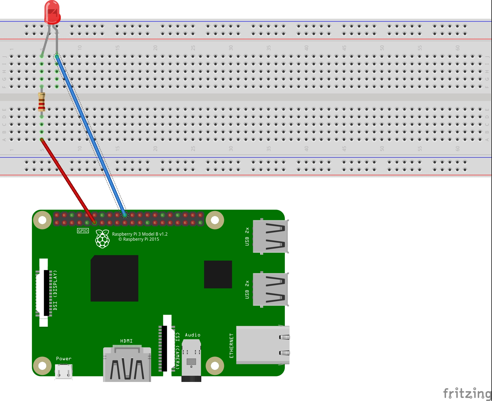
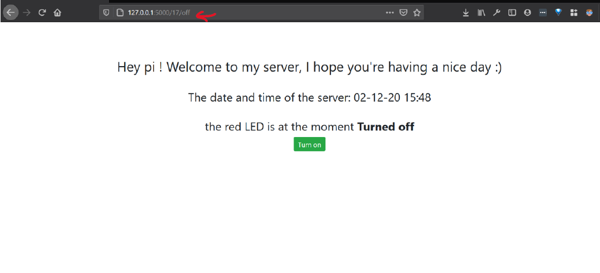
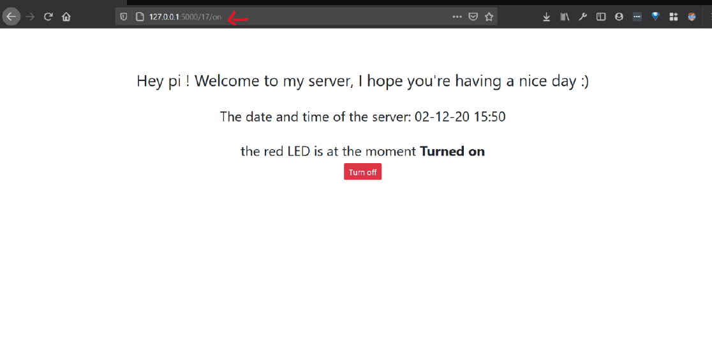

# Flask-LED-lightning
Light up an LED connected to a Raspberry Pi through a minimal Webserver using Python3 and Flask.

## Installation and Running

### Hardware

- 1x Raspberry-pi
- 1x LED
- 1x Resistor
- 2 Jumper cables

Connect the LED of choice to the `GPIO pin Nr.17` with the help of Jumpers and Breadboard.

### Software

1. Install python3 `sudo apt install python3` or using Homebrew using the following fomula: `brew install python@3.9`
2. Install and update Flask: `pip install -U Flask`
3. For Linux/MacOSX: set the environmental variable `export FLASK_APP=app.py`. For Windows: `set FLASK_APP=app.py`
4. Run using `flask run`

The webserver has two Endpoint that can be controlled using the browser:
1. `on`: Turns on the LED
2. `off`: Turns off the LED

### Samples
Turned **off** LED

Turned **on** LED

